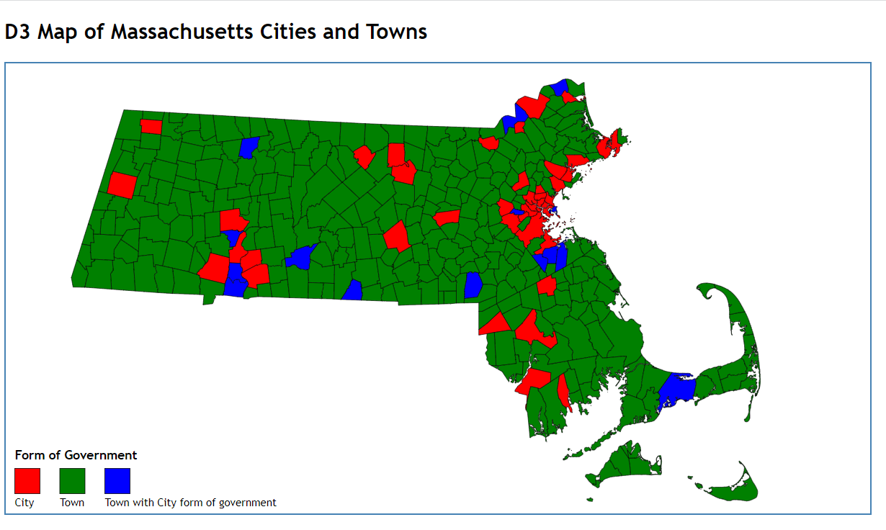

# d3-thematic-map-demo
Demo of generation of thematic map with d3.js.

This demo loads the D3 library from a CDN.

Presented at April 3, 2015 CommGIS meeting and at MassIT on April 24, 2015.
The original version used version 3 of the d3.js library; it was migrated to version d3.js version 6 on January 6, 2021.



## Internals
### Loading of the Data
Execution begins with the statement
```
d3.json("json/TOWNS_POLYM.geo.json").then((data) => { generateMap(data); });
```
which loads the GeoJSON for the MassGIS TOWNS_POLYM layer asynchronously using d3's __d3.json__ method.
When loading of the data is complete, the function __generateMap__ is called to create the map visualization.

### Creating the Visualization
Creation of the visualization is broken down into the following steps,
which are indicated by comments in the JavaScript source file:
1. Define dimensions of SVG drawing space
2. Create SVG drawing space and append it to the HTML DOM
3. Define the native projection of the data (Mass State Plane, NAD 83, meters)
4. Create a 'geographic path generator' function to create SVG \<path\> elements from the raw geographic data;
   one SVG \<path\> element is created for each geographic feature, i.e., for each town.
5. Define a color palette to symbolize the map
6. Create the SVG \<path\> for each town
7. Create a data structure to hold the information to render in the map legend
8. Create the SVG \<rect\> elements for the color swaths in the legend
9. Create the SVG \<text\> elements for the legend's caption
10. Create the SVG \<text\> elements for the second line of text in the legend

The GeoJSON spec calls for all geographic data to be in the EPSG:4326 spataial reference system, i.e., "latitude and longitude."
Unfortunately, data in this \(spherical\) coordinate system looks odd when rendered in 2-dimensions, particularly when the
extent of the data is as large as Massachusetts.
We consequently project the geographic data from EPSG:4326 to EPSG:26986, the _rectangular_ coordinate system used for all 
Massachusetts data. Once projected, the data has to be scaled and "translated" \(i.e., moved in the 2-dimensional plane\) to
fit within our SVG drawing area. While this step might seem daunting at first, once it is understood it can be applied in "boilerplate"
fashion when generating other cartographic visualizations of data with the same geographic extent.

The relevant code is as follows:
```
	// Define projection: Mass State Plane NAD 83 Meters.
	// Standard parallels and rotation (grid origin latitude and longitude) from 
	//     NOAA Manual NOS NGS 5: State Plane Coordinate System of 1983, p. 67.
	// The scale and translation vector were determined empirically.
	var projection = d3.geoConicConformal()
		.parallels([41 + 43 / 60, 42 + 41 / 60])
		.rotate([71 + 30 / 60, -41 ])
		.scale([13000])
		.translate([500,560]);
```

A copy of the [NOAA Manual NOS NGS 5: State Plane Coordinate System of 1983](https://github.com/CTPSSTAFF/d3-thematic-map-demo/blob/master/pdf/ManualNOSNGS5.pdf)
is found in the 'pdf' subdirectory of this repository, for reference.
A glance at it will reveal the source of the '.parallels' parameter to the d3.geoConicConformal projection call quoted above.

## Running the app
* Clone the repository into a directory, call it 'x'
* 'cd x'
* python -m http.server 8888 --bind localhost
* In a web browser:
  * http://localhost:8888

## Colophon
Author: [Ben Krepp](mailto:bkrepp@ctps.org)  
Address: Central Transportation Planning Staff, Boston Region Metropolitan Planning Agency  
10 Park Plaza  
Suite 2150  
Boston, MA 02116  
United States